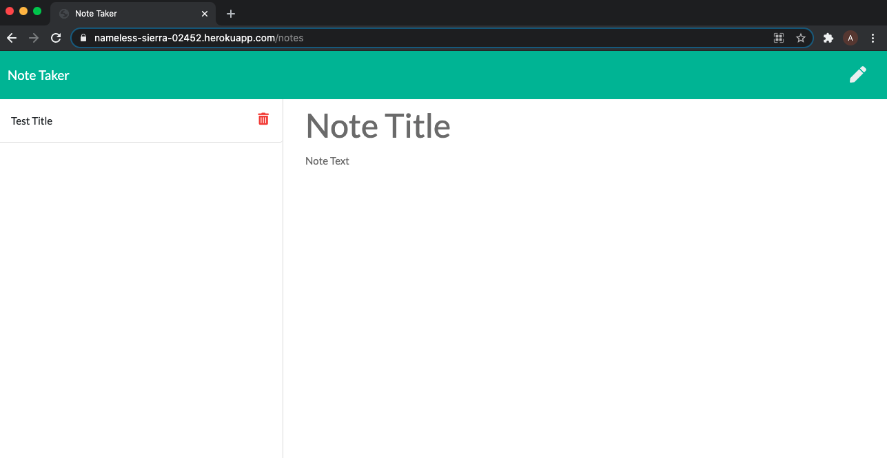
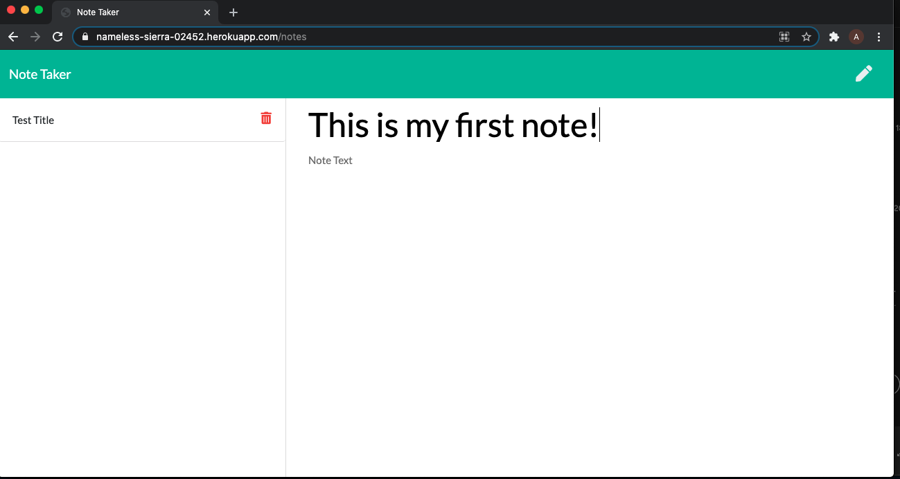
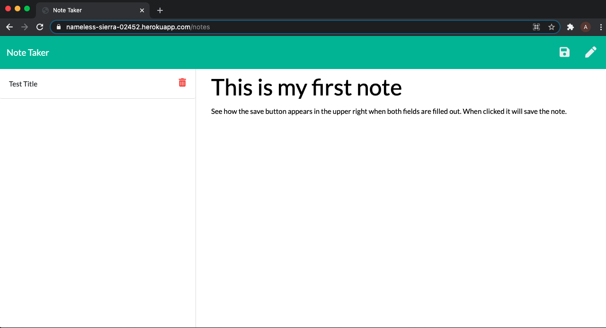
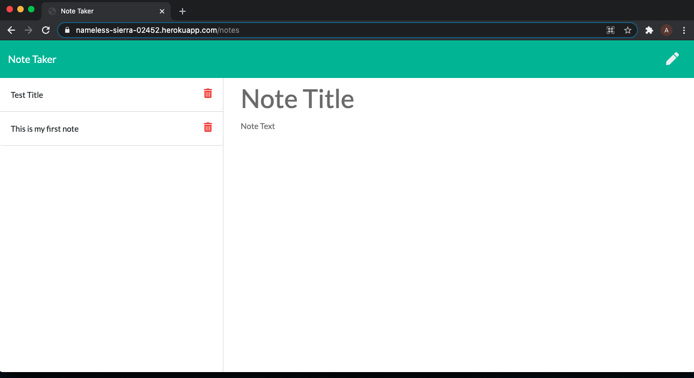

# Noted
This is a dynamic note taker using node.js.  Noted is a back end application that uses Node.js and Heroku.  The application utilizes fs, express and uniqid npm packages for use.  The application allows the user to take notes, save notes and delete notes from a live server.

## Using the application

The application is deployed through Heroku and has a live url (https://nameless-sierra-02452.herokuapp.com/).  When the application is deployed the user is brought directly to the home page of the website.

When the user selects the 'Get Started' button, they are brought to the '/notes' route where they can enter a note with a title and some text.

The user is now able to fill out the title of the note and the body of the note.

When the user fills out both fields, a saved icon appears in the upper right hand corner of the screen, confirming to the user that thye can save the note they have made.

Once the saved button is clicked, the text fields return to there original prompts of noting the user can write a note and the note is saved in the left column.

The user can delete the message by clicking the trash can directly next to the saved note.

## Tech

